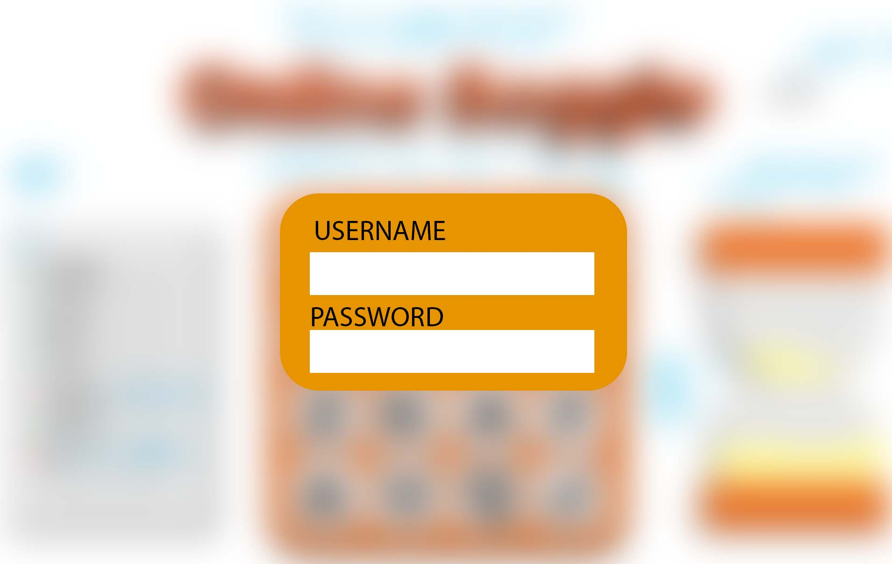
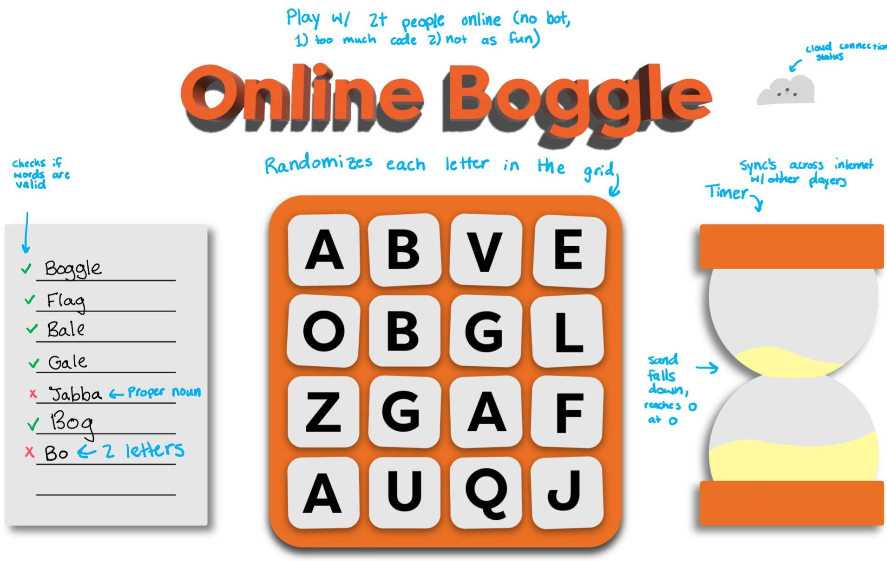
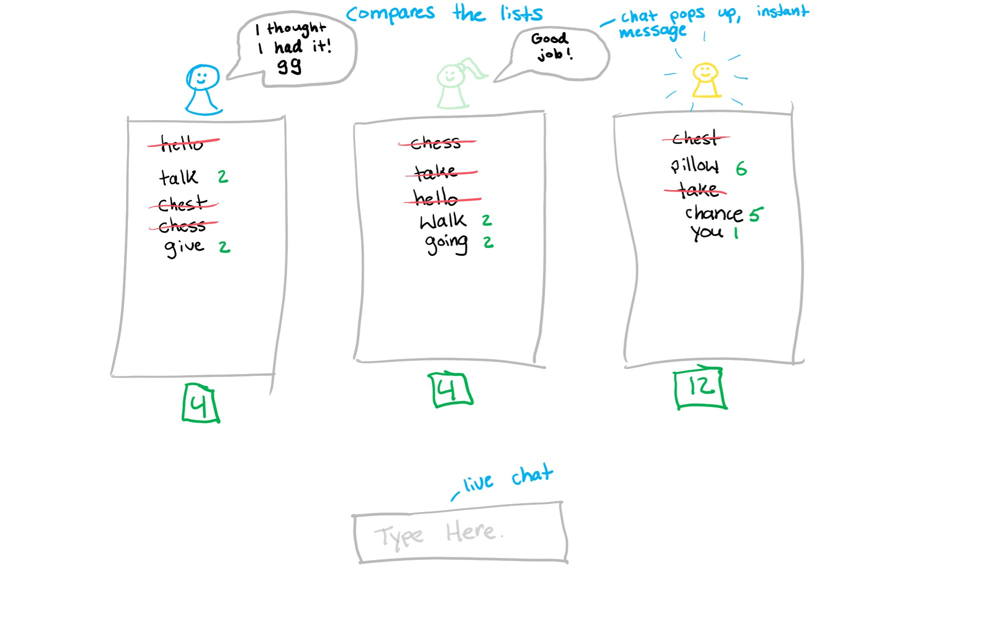

# Online Boggle Startup (CS 260)
## 30 Second Pitch:
```
This startup application is a solution to the extremely common problem with the board game Boggle, where 
all players have to be in person. In this application, Boggle will be accessible to users across the 
world, all in real time based on the round they are in.
```
## Key Features:
- Online real-time with timer
- Everyone has the same board
- User login
- Voting screen (post-round to determine points)
- Stats Board
- 2 to 6 players

### NOTE: PAIR PROGRAMMING
> Ethan Bishop and Blake McGhie





### Ethan's Notes:
```
IP Address: 3.131.64.245
ssh -i ~/.ssh/cs260.pem ubuntu@3.131.64.245

Command-line:
- touch: creates/modifies files
- mkdir: creates a directory
- chmod: restricts the permissions on a file
- curl: enables data exchange between a device and a server (get info about a site)

General:
- "A" record is a mapping between a DNS resource and a domain name
- "NS" record is a Name server record, which delegates a DNS zone to an authoritative server - to make sure that the DNS records and the DNS registration match
- "SOA" record is teh Start of authority, used to designate the primary name server and administrator responsible for a zone
- SVG's are kind of a pain to work with, but I found out how to make them in illustrator (as I normally do) and export them as code
- Flexbox can be kind of a pain honestly...I don't know how I got stuck trying to center a div so that multiple elements could play nicely as the window is resized. It seems like it should be simple, but it wasn't
- I got flex to work! After some nice testing, I was finally able to get everything to play nicely and put together something. It finally clicked how things worked. Now I have a mess with the margins and padding causing some problems, but I think I can put together something nice for the startup now and make it look decent.
-before working with bootstrap, I thought it was kind of an 'all or nothing' approach where you either implement bootstrap in everything, or you do everything yourself. With the SIMON css, I was able to see how you can implement both your own css and bootstrap working together. However, the way I integrated them caused some problems and took a bit of work to fix

SIMON:
- The buttons for SIMON were suprisingly a lot, svg within a button within a cell, within a table, within a div
- I really wanted the pages to have a common header/footer that I could just have separately and import so I wouldn't have to do so much
copying and pasting. Needless to say, that was a rabbit hole I never really figured out, maybe someday as I get better at this web programming stuff
- This last one with JavaScript implementation was pretty difficult to remember everything. There's some weird lag with my delay function. Sometimes it works flawlessly and quickly, other times it sits there for a few seconds. I'll have to look into that and see what would cause setTimeout to take longer than intended
- Implementing the updating quote and image api was fun. Simple way to make the about page fun and a game in of itself
- I found out that powershell is able to install npm modules, so that was nice! Instead of having to navigate with ubuntu I'm able to do that (hopefully it doesn't cause any problems with the server)
- npm init -y (important to remember -y means saying yes to all of the options it has for you. If I need to customize it, either edit the package.json or use the questions it asks instead of using -y)
- the database implementation was pretty straightforward, I had a problem with it trying to reference professor Jensen's cluster instead of my own - this was fixed by closing pm2 simon and running node index.js (to see if there were any errors, which there weren't) and starting pm2 simon again. This was in #common-problems, and such a simple fix for what seemed to be an unexplainable problem, I thought there were environment variables hidden somewhere, but nope
- login persitency was simple enough, it was straightforward and similar to the small assignments previously. It's interesting the scores is now mixed between email and username, so now I have a score attributed to a user with an email and a score without that connection (because it was created before the login system)

Startup:
- Decided on some colors that might look nice for the startup: #619EF3 (light blue, primary color, white text) #FFFFFF (white, text, background) and #FFB746 (orange, sendondary color, black text)
- debugging with dashed lines has been super helpful to find out where margins and padding is pushing things and what elements we have to edit
- flex was able to help us center so many things
- bootstrap has some interesting things that a lot of our things inherited (like margin and padding) and we had to override a lot of them to make the page even look decent
- document.querySelectorAll returns a NodeList NOT a normal array, iterate across the list using .forEach() function
- .checked is a a value of checkboxes, returns true or false
- modal - how to make it pop up immediately on page load has changed like 4 times in the last few years, so finding sources on that was hard. .show() is what you use

const myModal = new bootstrap.Modal(document.getElementById('myModal'));
myModal.show();

- parse the JSON before trying to use the object you set in storage

MongoDB
- keep credentials in environment variables and reference them through process.env.<variable-name>

```
### Blake's Notes:
```
IP Address: 3.132.220.196
ssh -i (key) ubuntu@3.132.220.196

- For some reason I was having trouble with deploying my simon files to my server, a TA was able to 
help me fix it. We literally just restarted Caddy and it worked for some reason...

Simon:
-   I learned that I should probably be keeping track of certain commands for deployment and ssh in order
to not get confused when working in the terminal.

$ ./deployFiles.sh -k ../../../../keys/mcghiebadmin.pem -h mcghie-blake.click -s simon
$ sudo systemctl restart caddy

CSS Practice:
-   CSS is super powerful, I've always had a little bit of trouble with navbars, but this assignment I took a lot of time to practice it.

CSS Flex:
-   I am really enjoying flex.
-   The Frog game was super helpful, I did all of the puzzles. Also used it as a pretty quick reference guide. 

CSS Frameworks:
-   I really like Bootstrap and its ability to provide quick and functionally sound reactive elements.
-   It might take me some time to fiddle with it to look a little less boring, but for now Bootstrap is on my list of things to study and get good at.

Simon CSS:
-   Now that I have had a chance to dive further into Bootstrap and its capabilities I am feeling a lot more comfortable.
-   For this assignment I taught myself how to use the in browser debugger with vscode LiveExtension, and it ended up being insanely useful.

HTML/CSS Startup Deliverable:
-   A useful tool I learned to override Bootstrap is the !important tag you can add you your CSS statements.

Simon Javascript:
-   I learned a very valuable lesson to be careful with indentation while writing javascript. I was bug hunting for nearly an hour and a half before I realized my mistake.

Startup Javascript:
-   Learning how to show and hide modals was super annoying because the documentation for it sucks.
-   I learned how to store JSON on the local storage and pull it back when needed on a seperate page
-   You can add .checked after a checkbox DOM object to see whether it is checked or not.

Node.JS:
-   I really like the functionality of this.
-   I haven't seen localhost used in many places, but it is interesting that it is used here.

Simon Service:
-   Service endpoints seem like an incredibly useful tool.
-   const port = process.argv.length > 2 ? process.argv[2] : 3000; means port 3000, change to 4000 for startup

SimonDB:
-   Don't forget to tell the DAEMON to reload the environment and use the changes, (I forgot to do this and it took a while to figure out lol).
-   Make sure you restart the terminal when your development environment variables change
-   An easy way to check if your env-variables are proper is "echo ${env-variable}"

Simon Login:
-   bcrypt is super cool, it hashes out the text you want, then you can check it against other text hashed out. This is a more secure way to store and authenticate passwords.
```
